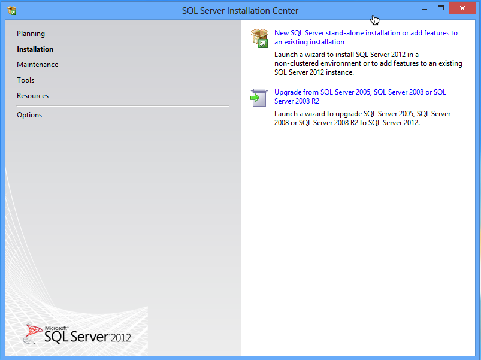
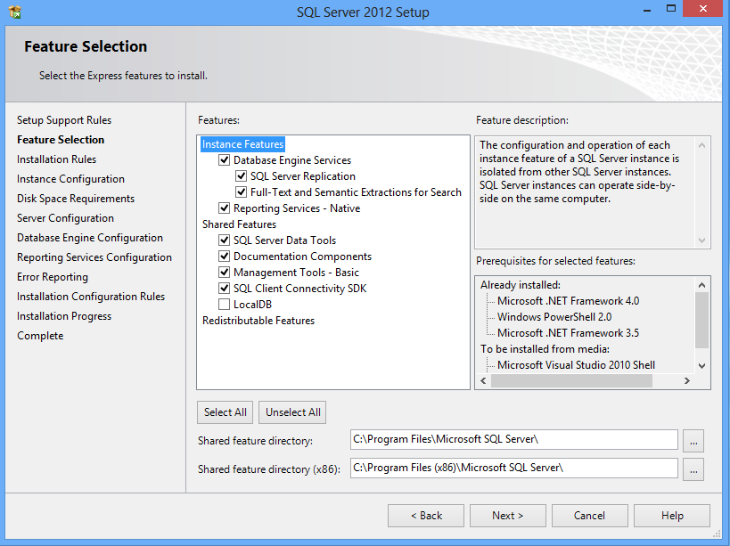
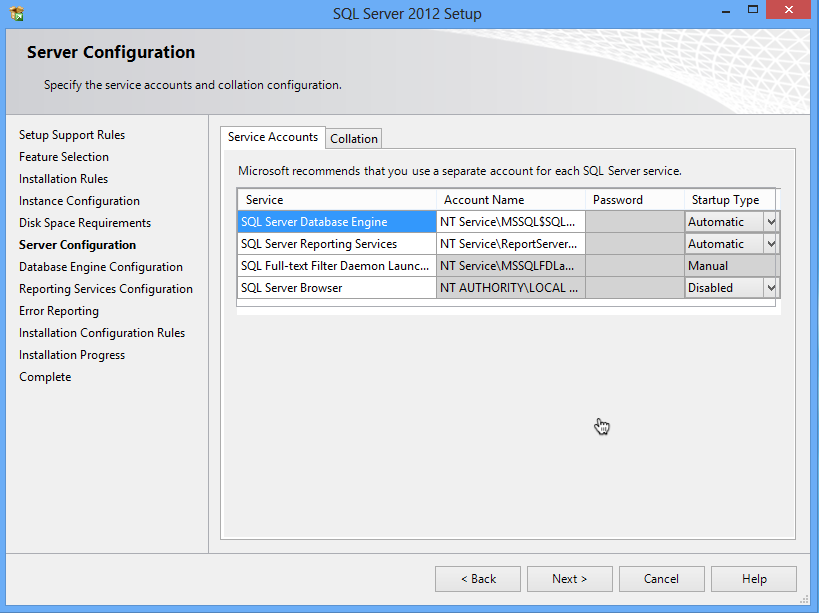
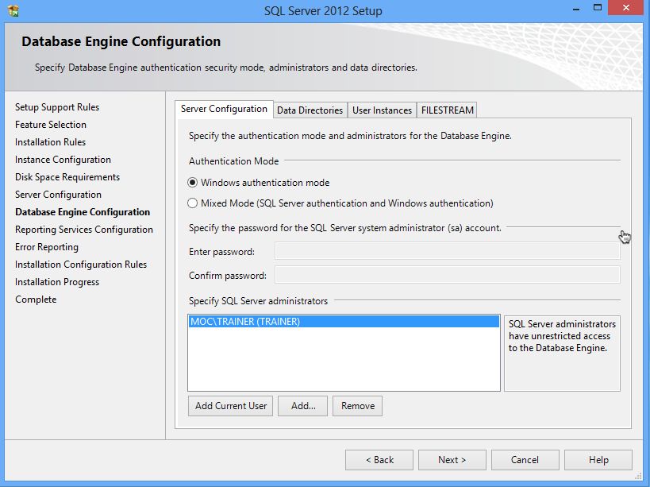
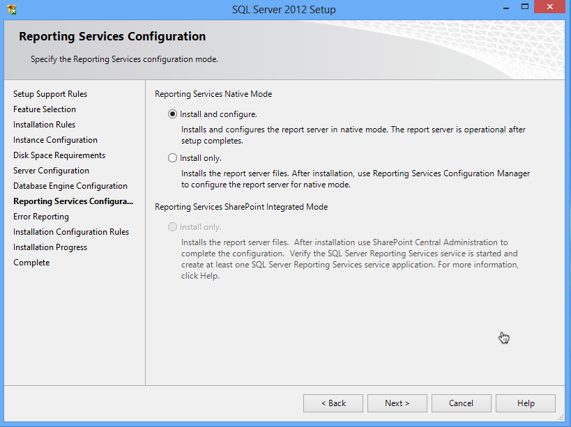
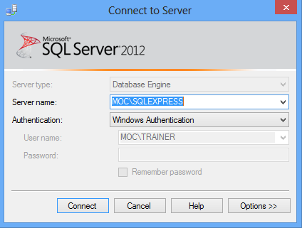
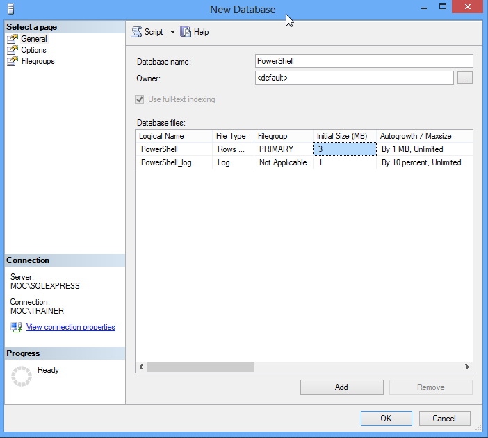

# Intro and Setting up the SQL Server

## What This Book is About

This book assumes that you need to create reports that utilize stored data - typically, historical data on resource consumption or something like that. If you just need to pump out quick inventory reports, like system configurations or something, check out _Creating HTML Reports in PowerShell_. That's a lot simpler.

I know a lot of folks find themselves in the position of having to "do it yourself" when there are perfectly great tools out there - problem being those tools cost money, and The Boss won't spend money. Let's be clear that The Boss is stupid, or at least penny-wise and pound-foolish, because you're going to spend enough time building your own reporting tools that, strictly based on your salary, a tool would be cheaper. But at least, if you're going to build your own reporting tools, you can do a good job of it!

I know a lot of administrators use Excel for stuff like this. The scripts I've seen, where people are manipulating Excel through its Component Object Model (COM) interface, manipulating cells and inserting charts and graphs... oy. The scripts I've seen. It's a lot of work. It's a kludge. It's a hack. I know Excel seems easy to start with, but the curve is logarithmic: every little thing you want to add - another chart, another page, another data series - gets harder and harder. _Excel isn't a database_, nor it is a reporting system. Yes, it's free (well, you've already bought it, so it doesn't cost extra), but you're using it for entirely the wrong purposes. "But it's easy to learn!" I'm told by its fans. Well, yes - to a point. But if some administrators added up all the time they've spent hacking Excel and dealing with its API's shortcomings, they'd have had time to learn something better instead.

Hence, this book.

We're going to build a system that uses PowerShell to collect data and add it to a SQL Server database. We're going to use SQL Server Reporting Services to build reports off of that database - reports which, I might add, can be scheduled and delivered and are generally better-looking than anything you could do in Excel. And it's going to cost us nothing. I'm going to give you tools that make this easy, and in large part hide all the underlying SQL Server complexity. I'm a nice guy that way (donations cheerfully accepted on [http://PowerShellBooks.com](http://PowerShellBooks.com) if you're appreciative).

Ditch Excel. Let's do this reporting thing _right_.

## System Requirements

All you're going to need is SQL Server 2012 Express with Advanced Services, which you can download for free from [http://www.microsoft.com/en-us/download/details.aspx?id=29062](http://www.microsoft.com/en-us/download/details.aspx?id=29062). If you already have a SQL Server on your network, and it has the SQL Server Reporting Services (SSRS) installed, that'll work as well. Any version of SQL Server with SSRS, in fact, will do the job. 2012 Express, in particular, can be installed on Windows 7, Windows Server 2008 R2, Windows Server 2008 (SP2), Windows 8, and Windows Server 2012. There are 32-bit and 64-bit editions to suit any environment, and you only need a couple gigabytes of RAM to run it well.

You'll need .NET Framework 3.5 SP1 and 4.0 installed as a pre-requisite.

Of course, you'll need Windows PowerShell. For the purposes of this book, I'm assuming you're running PowerShell v3. I'm not sure if anything in here won't work in 2.0, but I'm not testing it. 3.0 runs on the same operating systems, with the same requirements, as SQL Server 2012 Express, so just download it, install it, and you should be good to go.

There's no need for a dedicated server infrastructure. If you want, you can just install SQL Server on your desktop or laptop - it's fine for what we're doing.

## Installing SQL Server 2012 Express

If you already have a suitable SQL Server on your network, you can skip this chapter. I'm assuming that you're installing this on your desktop or laptop, and that you'll be the only one using it, so we're going to do a very lightweight, easy version of the installation. The tools I'm going to provide you are built to quickly and easily connect to a local SQL Server 2012 Express instance, although they're also capable - with a bit more syntax from you - of connecting to any SQL Server anywhere on your network.

As a bonus, as I walk you through this installation, I'm going to point out a few SQL Server concepts. You don't necessarily need them, but it'll make troubleshooting easier, and it'll make you a generally better admin. Having a few basic SQL Server concepts under your belt can't possibly hurt, given how widespread SQL Server is in any modern organization.

Starting after your SQL Server 2012 Express (with Advanced Services) download completes, you're going to double-click the installer to kick things off. If your computer has User Account Control (UAC) enabled, make sure you run the installer as Administrator, because that's what you'll be running PowerShell as. It's important that SQL Server be available to the same account that you use to launch PowerShell.

You're going to do a new stand-alone installation, so click that link:

By the way, it's generally fine to have SQL Server 2012 installed alongside another version, should you happen to have another version already installed.

SQL Server's installation wizard will go through several screens, including a license agreement, some pre-requisite checks, blah blah blah. It's a pageant. Here's where you come in:\

Those defaults are pretty much what you want. Click Next.

This is an important bit. SQL Server Express installs a named instance of itself, named SQLExpress. This will fail if you already have an instance running under that name. A named instance is basically a copy of SQL Server that requires you to specify your computer name and the instance name in order to connect. Whatever you put here, remember it. I'm going to assume you're sticking with the default SQLEXPRESS.

Confirm your disk space requirements on the next screen, and get to the server configuration:

For our purposes, the defaults are fine. Next is the Database Engine configuration:

Again, the defaults are fine if you're just installing SQL Server to support this reporting functionality. It's going to default to Windows authentication, meaning it uses your current login, and it's going to add your current login account as an administrator of SQL Server.

This is important: SQL Server has this feature called "user instances." It means that, if a non-admin tries to run SQL Server, they get their own isolated instance of it. It's all magical and transparent, but it won't include the databases from other instances. So it's really important to make sure that the "Specify SQL Server administrators" box lists the user account(s) that you'll use to run PowerShell. Otherwise we'll never get everything to match up. You can add accounts, including domain accounts, if needed. You're just giving these accounts permissions inside your local SQL Server installation, so it's no big danger or security risk.

Stick with the default, to install and configure. From there, you're done. "Next" your way through the rest of the wizard and go get a cup of coffee.

_Note: If you don't select "install and configure" then Reporting Services won't be set up for use. After installation, you'll have to create a Reporting Services database and do a bunch of other stuff. You may have to do that if you're starting with an existing SQL Server installation where SSRS isn't already configured. Setting that up is beyond the scope of this book._

## Setting Up a Database

Now, there are a _lot_ of ways you could set up a database. I'm assuming, if you're reading this book, that you (a) know relatively little about SQL Server, (b) want to more or less keep it that way, and (c) don't want to deal with much complexity. So I'm going to have you create a single database in which all of your historical data will be stored. The tools I'm giving you will take care of creating their own tables in which to store data, so we just need to give them a database in which to do so.

## Asking for a Database

If you're planning to use a SQL Server instance that's already running in your environment, you'll need to get the DBA to set up a database for you (if you're the DBA, then you'll know how). Have them:

- Add a Windows login, to SQL Server, for whatever account you use to run PowerShell.
- Create a database. Name it anything - you'll just need to know them name.
- Add your Windows login to the database's db\_owner (database owner) database role.

They're going to have to tell you the server name also, and if your database isn't in the default instance you'll need to know the instance name.

## Making a Database

If you're using a local SQL Server Express instance, start by opening SQL Server Management Studio. Log in using Windows Authentication and whatever account you use to run PowerShell - you won't provide a password here. Notice that it's pointed at my computer name ("MOC") and instance name ("SQLEXPRESS").

Right-click the Databases folder, select New Database, and fill in the dialog box.

You can pretty much accept the defaults after supplying a database name (letters only to keep it simple; I've used "PowerShell"). I'm skipping over a _lot_ of SQL Server details, here; suffice to say that these defaults result in a pretty maintenance-free database. Scroll to the right a bit to change the location of the database files.

If you're worried about backing up your data, you can read up on how to use SQL Server to run backups. I'm assuming that you're not putting anything mission-critical in here, so that it doesn't need backed up; if you're concerned about backups then the right thing to do is use a full, backed-up SQL Server instance that's on a network server someplace. SQL Server Express is kind of intended for "I won't miss it much if it's gone" kind of work.
